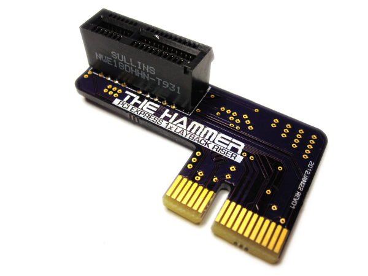

# PCI Express Layback Riser

This was used in an earlier version of the CNC controller to allow a PCI Express parallel port card to plug into the embedded computer board in a mechanically suitable way.  This is no longer used in the current version of the controller.

