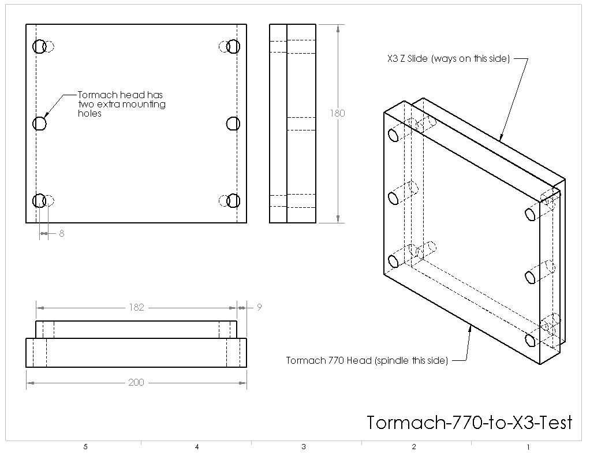

# Tormach 770 Full Machine Head Transplant

In November 2014, I embarked on the crazy task of grafting a Tormach PCNC 770 head and spindle onto the Sieg X3.  This was done by only modifying the Tormach head, leaving the possibility to return the machine to full stock format if needed.

Project build log is archived in the following thread.  https://www.cnczone.com/forums/vertical-mill-lathe-project-log/201298-tormach-engineering-software-forum.html

